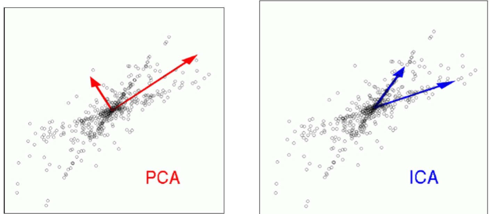
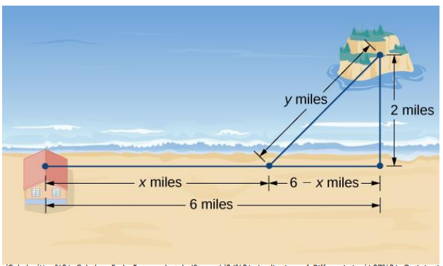

# DIMENSIONALITY REDUCTION
## PCA(Principal components analysis)
1. The idea is simple: We want to find an “axis” $w_1$, when projected on it, the sum of squares of $x_i$ projections are maximum.
2. Λ = diag(𝜆1, ⋯ , 𝜆𝑝) is a diagonal matrix consisting
of eigenvalues of $X^TX$ where X is the data.

### Score of reducing the N dimension to k
1. PoV(Proportion of Variance) $$PoV(k) = \dfrac{\lambda_1 + ... + \lambda_k}{\lambda_1 + ... + \lambda_p}$$
2. Typically pick k where PoV(k) > 0.9, where the number can be decided by the user(?).

## FA(Factor analysis)
1. See if the observed variables are effecting the hiden factor(latent factor)
2. First we need to set our goal => How many latent we should choose.
3. Then we have to divide the factors into groups by checking their covarience to each others.
4. Use pseudo inverse to do the transformation.

## ICA(Independent components analysis)
1. For distinguish the source from Mixed Data => Blind Source Separation.
2. ICA will choose the base vector which more fit on the data distribution.

## LDA(Linear discriminant analysis)
1. If we are dealing with the data which has k classes, the max number of dimension after LDA is (k-1). => because we only need k-1 lines devide the data into k classes.
2. supervised learning approach.

# OPTIMIZATION AND GRADIENT DESCENT BASICS
## Simple concept about optimization
1. If we want to go to (6 , 2) by swimming and running from (0, 0). Coast is only on axis-x, so we need to swimming any way, please schedule a best distribution of these two ways to arrive there in shortest time.

## Lagrange multiplier
1. To solve a function $f(x, y, z)$ with constraint $g(x,y, z)=k$ 
2. Do parital derivative to $f = \lambda g$ for $x, y , z$ and solve it.
3. We get x, y, z from last step, put it into $g()$ to find $\lambda$
4. Finally, don't forget to check the $x, y,z$ are still in the constraint!  
### example
1. Maximize $𝑓(x, y) = 𝑥 + 𝑦$ subject to $𝑥^2 + 𝑦 ^2 = 1$
2. $L(𝑥, 𝑦, \lambda) = 𝑥 + 𝑦 + \lambda(𝑥^2 + 𝑦^2 − 1)$
3. Solve $\dfrac{\partial}{\partial x} L = 0$, $\dfrac{\partial}{\partial y} L = 0$ , $\dfrac{\partial}{\partial \lambda} L = 0$
# What if there are no constraint?
## Gradient Descent Method
1. $x_{k+1} = x_{k} - \eta \nabla f(x_k)$ where $\eta$  is a small positive number.
2. set a initial point $x_k$ to slowly approach to the answer.

## Regularization
1. [L1 L2 normalization](https://hackmd.io/@kk6333/BkIDyLikj)
    * L1 : $||w_1|| = \sum_{i} |w_i|$
    * L2 : $||w_2|| = \sum_{i} (w_i)^{2}$
2. Rewrite it to Lagrange multiplier
    * $L(w, \lambda) = Loss(w) + \lambda ||w_2||$ 

# NEURAL NETWORKS
## Neuron
1. Use activate function to mimic the Neuron mechnism.
    * composed by : weight(w), input(x), bias($\epsilon$)
    * kinds of activate function.
        * sigmoid : $y = \dfrac{1}{1+e^{-x}}$, and derivative of it is $y\prime = y(1-y)$
        * Relu : $y = max(0, x)$, and derivative of it is $if y>0, y\prime = 1 ; if y<0, y\prime = 0$
        * softmax : $y= \dfrac{e^{z_l}}{\sum_{k = 1}^{n} e^{z_k}}$, and derivative of it is $\dfrac{\partial}{\partial z_i}y_l = \begin{cases} y_l(1-y_l), if \space i = l \\ 
    -y_ly_i, if \space i \space \neq l\end{cases}$

# BACK PROPAGATION
1. Derivate the forward steps from end to the target point to update.

# Loss function
1. MSE
2. Cross-entropy 
3. KL divergence

# CONVOLUTIONAL NEURAL NETWORKS
## The size of output data
* Standard conv (down sampling) : (i+2p-k)/s+1
* Transposed conv (up sampling) : (i+1)*s + k -2p
## subsampling
* splitting one kernel into 4 subkernels
 
# CONDUCTING EXPERIMENTS
## Sensitivity vs Specificity (medical)
* Sensitivity, **recall**, hit rate, or true positive rate (TPR) $$TPR = \dfrac{TP}{P} = \dfrac{TP}{TP+FN} = 1-FNR$$
* **Specificity**, selectivity or true negative rate (TNR) $$TNR = \dfrac{TN}{N} = \dfrac{TN}{TN+FP} = 1- FPR$$
* **Precision** = $\dfrac{TP}{TP+FP}$
* Some papers also use 𝐹1-measure $$F_1 = 2 \dfrac{Precision×Recall}{Precision+Recall} (in the range 0~1)$$
## Confusion Matrix
* Be aware of the column(or row) is sum to 1, which stand for the original data.
 

