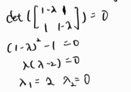
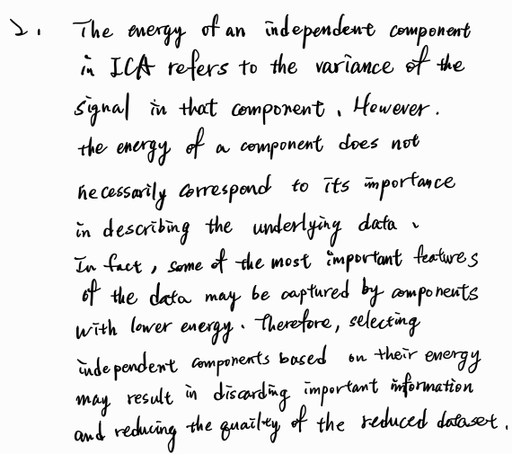

## Machine learning : HW 04 王上澤 111598067
1. Since the two attribute are jointly Guassian, we can know that the first principal componentis a linear combination of original attributes, and its length is equal to the square root of the largest eigenvalue of the covariance matrix.
    * compute the largest eigenvalue = 2 from : <br>
    
    * calculate the tatol variance of data : 0+2 = 2
    * PoV(1) = 2/2 = 1, which is bigger than threshold 0.9 .
    * Can we answer the question without computing eigenvalues? Yes! We can use SVD to solve this problem when we encounter the numeric problem in computing the eigenvalue of (X transpose)X.  
<br/>
    
2. 
3. There are only two classes need to be classified, so we only have to project data to one dimentional space to determined which class is it.
4. Code of the first part :
    ```python
    import pandas as pd

    from sklearn.model_selection import train_test_split
    from sklearn.preprocessing import StandardScaler
    from sklearn.discriminant_analysis import LinearDiscriminantAnalysis
    from sklearn.decomposition import PCA
    from sklearn.metrics import confusion_matrix
    from sklearn.metrics import accuracy_score

    cancer_data = pd.read_csv("../data/breast-cancer-wisconsin.data", 
                            names=[i for i in range(11)])
    cancer_data = cancer_data.drop(cancer_data.columns[0], axis=1)
    cancer_data = cancer_data.replace(to_replace='?', value=pd.NA)

    ## remove the row that miss the attribute
    cancer_data.dropna(inplace = True) 
    cancer_data = cancer_data.reset_index(drop=True)

    # model
    model = PCA(
        n_components=9
    )

    # fit the data
    model.fit_transform(cancer_data)

    # show the PoV
    explain = model.explained_variance_ratio_.cumsum()
    for i in range(len(explain)):
        print("{0} component's PoV : {1}".format(i+1, explain[i]))
    ```
    output of the first part :
    ```console
    1 component's PoV : 0.6922791476392942 X
    2 component's PoV : 0.7634330286918276 X
    3 component's PoV : 0.8232826582399932 X
    4 component's PoV : 0.8671645576031523 X
    5 component's PoV : 0.9056767881037053 O
    6 component's PoV : 0.9396796501298136 O
    7 component's PoV : 0.9646552635230422 O
    8 component's PoV : 0.9868358860997716 O
    9 component's PoV : 0.9980522102246421 O
    ```
    We can see that after 5 conponents result, the PoV of it start to bigger than the threshold (0.9).
    Code of Second part :
    ```python
    import pandas as pd

    from numpy import average
    from sklearn.model_selection import train_test_split
    from sklearn.preprocessing import StandardScaler
    from sklearn.discriminant_analysis import LinearDiscriminantAnalysis
    from sklearn.ensemble import RandomForestClassifier
    from sklearn.decomposition import PCA
    from sklearn.metrics import confusion_matrix
    from sklearn.metrics import accuracy_score

    cancer_data = pd.read_csv("../data/breast-cancer-wisconsin.data", 
                            names=[i for i in range(11)])
    cancer_data = cancer_data.drop(cancer_data.columns[0], axis=1)
    cancer_data = cancer_data.replace(to_replace='?', value=pd.NA)

    ## remove the row that miss the attribute
    cancer_data.dropna(inplace = True) 
    cancer_data = cancer_data.reset_index(drop=True)

    # split the data
    data_train, data_test, target_train, target_test = train_test_split(
        cancer_data[[i for i in range(1, 10)]], cancer_data[10], test_size=0.3
        )


    # iterate from 1 to 9 and show the accuracy of it
    for n_component in range(1,10):
        accurs = []
        for iter in range(10):
            # split the data
            data_train, data_test, target_train, target_test = train_test_split(
                cancer_data[[i for i in range(1, 10)]], cancer_data[10], test_size=0.3
            )
            model = PCA(n_components=n_component)
            data_train = model.fit_transform(data_train)
            data_test = model.transform(data_test)
            
            # random forest classifier
            classifier = RandomForestClassifier()
            classifier.fit(data_train, target_train)

            target_pred = classifier.predict(data_test)
            accurs.append(accuracy_score(target_test, target_pred))
        print("10 times accuracy = {0}  \tin choosing {1} components."
            .format(str(average(accurs)), n_component))

    ```
    Output of Second part :
    ```console
    10 times accuracy = 0.9541463414634146          in choosing 1 components.
    10 times accuracy = 0.9668292682926829          in choosing 2 components.
    10 times accuracy = 0.9717073170731705          in choosing 3 components.
    10 times accuracy = 0.9790243902439025          in choosing 4 components.
    10 times accuracy = 0.9717073170731707          in choosing 5 components.
    10 times accuracy = 0.9712195121951218          in choosing 6 components.
    10 times accuracy = 0.9697560975609754          in choosing 7 components.
    10 times accuracy = 0.9697560975609754          in choosing 8 components.
    10 times accuracy = 0.9746341463414634          in choosing 9 components.
    ```

5. Code :
    ```python
    import numpy as np
    import pandas as pd

    from sklearn.model_selection import train_test_split
    from sklearn.decomposition import FactorAnalysis
    from sklearn.neighbors import KNeighborsClassifier
    from sklearn.metrics import confusion_matrix
    from sklearn.metrics import accuracy_score


    url = "https://archive.ics.uci.edu/ml/machine-learning-databases/iris/iris.data"
    names = ['sepal-length', 'sepal-width', 'petal-length', 'petal-width', 'Class']
    dataset = pd.read_csv(url, names=names)

    # preprocessing
    X = dataset.drop('Class', axis = 1)
    y = dataset['Class']
    # 10 times iteration
    for i in range(10):
        # Splitting the dataset into the Training set and Test set
        X_train, X_test, y_train, y_test = train_test_split(X, y, test_size=0.3)

        fa = FactorAnalysis(n_components=3)
        X_train = fa.fit_transform(X_train)
        X_test = fa.transform(X_test)

        classifier = KNeighborsClassifier(n_neighbors=5)
        classifier.fit(X_train, y_train)

        # Predicting the Test set results
        y_pred = classifier.predict(X_test)
        print('Accuracy ' + str(accuracy_score(y_test, y_pred)), str(i), "iteration")
    ```
    Output : 
    ```console
    Accuracy 0.9333333333333333 0 iteration
    Accuracy 0.8444444444444444 1 iteration
    Accuracy 0.9333333333333333 2 iteration
    Accuracy 0.9111111111111111 3 iteration
    Accuracy 0.9111111111111111 4 iteration
    Accuracy 0.8444444444444444 5 iteration
    Accuracy 0.9333333333333333 6 iteration
    Accuracy 0.9555555555555556 7 iteration
    Accuracy 0.9777777777777777 8 iteration
    Accuracy 0.9333333333333333 9 iteration
    ```


