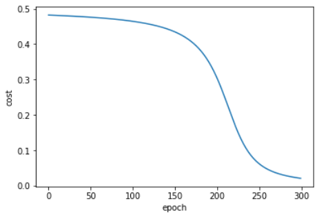

# Machine learning : HW 06 
## 王上澤 111598067
1. We mentioned in the lecture that the perceptron (pp. 8 of back propagation) with a loss function of $𝐽(𝒘) = |𝑧_𝑘𝑑_𝑘 | − 𝑧_𝑘𝑑_𝑘 $ can be trained with the following updating rule: $$
𝒘(𝑘 + 1) = 𝒘(𝑘) + \begin{cases}0\space if \space z_kd_k > 0, \\
\mu 𝒙_𝑘𝑑_k \space if \space otherwise \\
\end{cases}$$ Show that this algorithm is directly derived from the stochastic gradient descent algorithm.
    1. Loss Function:</br>The loss function used in the perceptron algorithm is defined as: $$\mathcal J(w) = |z_k \cdot d_k| - z_k \cdot d_k$$ where $z_k$ is the activation of the perceptron's output and $d_k$ is the desired output for a given training example.
    2. Gradient of the Loss Function:</br> To apply stochastic gradient descent, we need to compute the gradient of the loss function with respect to the weights (w). Let's denote the gradient as $\nabla \mathcal J(w)$.</br>The gradient of the loss function can be computed as follows: $$\nabla \mathcal J(w) = (\dfrac{\partial J}{\partial w_1}, \dfrac{\partial J}{\partial w_2}, ... ,\dfrac{\partial J}{\partial w_n}) = 
     (\dfrac{\partial |z_k \cdot d_k| - z_k \cdot d_k}{\partial w_1}, \dfrac{\partial |z_k \cdot d_k| - z_k \cdot d_k}{\partial w_2}, ... ,\dfrac{\partial |z_k \cdot d_k| - z_k \cdot d_k}{\partial w_n})$$ Now, let's compute the partial derivative of the loss function with respect to each weight: $$\dfrac{\partial |z_k \cdot d_k| - z_k \cdot d_k}{\partial w_i}=\dfrac{\partial (|z_k \cdot d_k|)}{\partial w_i}-\dfrac{\partial (z_k \cdot d_k)}{\partial w_i}$$ For simplicity, let's consider a single weight $w_j$ $$\dfrac{\partial (|z_k \cdot d_k|)}{\partial w_j} = \begin{cases}-z_k \cdot d_k \cdot \dfrac{\partial (z_k)}{\partial w_j}\space if \space z_k \cdot d_k < 0 \\
     z_k \cdot d_k \cdot \dfrac{\partial (z_k)}{\partial w_j} \space if \space z_k \cdot d_k > 0 \end{cases}$$ $\dfrac{\partial (z_k \cdot d_k)}{\partial w_j}$ is simply $d_k \cdot \dfrac{\partial (z_k)}{\partial w_j}$, as $z_k$ and $d_k$ are constants with respect to $w_j$. Putting it together, we have : $$\dfrac{\partial J}{\partial w_j} = \begin{cases} -z_k \cdot d_k \cdot \dfrac{\partial (z_k)}{\partial w_j}, \space if \space z_k \cdot d_k <0 \\
     0, \space if \space z_k \cdot d_k >0\end{cases}$$ Thus, the gradient of the loss function with respect to each weight can be expressed as: $$\dfrac{\partial J}{\partial w_j} = -z_k \cdot d_k \cdot \dfrac{\partial (z_k)}{\partial w_j}, \space if \space z_k \cdot d_k <0$$ $$\dfrac{\partial J}{\partial w_j} = 0, if z_k \cdot d_k > 0$$
    3. Updating Rule:<br>In the perceptron algorithm, the updating rule is defined as follows: $$w^{(k+1)} = w^{(k)}+ \mu \cdot x_k \cdot d_k$$ where $w^{(k)}$ is the weight vector at iteration $k$, $\mu$ is the learning rate, $x_k$ is the input vector, and $d_k$ is the desired output for the training example.
    4. Comparing with SGD: <br> To derive the perceptron algorithm from the SGD algorithm, we need to compare the updating rule of the perceptron with the general form of the updating rule in SGD.<br>In SGD, the updating rule is given by:$$w^{(k+1)} = w^{(k)} - \mu \cdot \nabla J(w^{(k)})$$ Comparing this with the perceptron's updating rule, we can see that they are equivalent if we define: $$\nabla J(w) = -x_k \cdot d_k \cdot \dfrac{\partial (z_k)}{\partial w}$$ Since $\dfrac{\partial J}{\partial w_j} = -z_k \cdot d_k \cdot \dfrac{\partial (z_k)}{\partial w_j}$ (as derived in step 2), we can conclude that the perceptron algorithm is directly derived from the SGD algorithm by using the specific loss function and updating rule mentioned in the question.<br><br>Therefore, the perceptron algorithm can be seen as a special case of stochastic gradient descent tailored for binary classification problems.
2. For the neural network given below, let $𝑤_1$ = 2.0, $𝑤_2$ to $𝑤_8$ be 1.0, $𝑑_1$ = 1.0, $𝑑_2$ = 0.0, $\mu$ = 0.1, $𝑥_1$ = 1.0, and $𝑥_2$ = −1.0. The activation function from $𝑞_1$ to $ℎ_1$ and $𝑞_2$ to $ℎ_2$ is `ReLU`, the activation function at the output nodes is linear (i.e., 𝑦 = 𝑧), and the cost function is $$J = \dfrac{1}{2} \mathop{\sum_{i=1}^2} (y_i - d_i)^2 $$
    1. Find $y_1$ and $y_2$ (forward computation)
        1. We first compute the $q_{in}$ and $q_{out}$ to find out the first layer value $$q_{1,in} = x_1w_1 + x_2w_2 = 1.0$$ and $$q_{2,in} = x_1w_3 + x_2w_4 = 0.0$$ and $$q_{1,out} = Max(0, q_{1,in}) = 1.0$$ and $$q_{2,out} = Max(0, q_{2,in}) =0.0$$
        2. We know that the $z_1$ and $z_2$ has activate function which is linear, so we assume it simply to $z_{out} = z_{in}$ so the value of $y_1$ and $y_2$ are : $$y_1 = z_1 = q_{1,out} \cdot w_5 +q_{2,out} \cdot w_6 = 1.0$$ and $$y_2 = z_2 = q_{1,out} \cdot w_7 +q_{2,out} \cdot w_8 = 1.0$$
    2. Find the value of $\Delta w_1 = \mu \dfrac{\partial J}{\partial w_1}$ by using the BP algorithm.
        1. From cost function, we found the $\dfrac{\partial J}{\partial y_1} = 0$ and $\dfrac{\partial J}{\partial y_2} = 1$ and start to use BP to update the $w_1$
        2. First we need to derivate every activate function $$f \prime(Relu(x)) = max(0,1), if \space x>0$$ and output node $$ f \prime (q_{out}) =1  $$  
        3. Second, we start to compute $\dfrac{\partial J}{\partial w_1}$ that $$\dfrac{\partial J}{\partial w_1} = \dfrac{\partial q_{1,in}}{\partial w_1} \cdot \dfrac{\partial q_{1,out}}{\partial q_{1,in}} \cdot \dfrac{\partial J}{\partial q_{1,out}}$$ and $\dfrac{\partial J}{\partial q_{1,out}}$ should be composed by $$\dfrac{\partial J}{\partial q_{1,out}} = \dfrac{\partial z_1}{\partial w_5}\dfrac{\partial y_1}{\partial z_{1}}\dfrac{\partial J}{\partial y_{1}} + \dfrac{\partial z_2}{\partial w_8}\dfrac{\partial y_2}{\partial z_{2}}\dfrac{\partial J}{\partial y_{2}}$$ and the final answer is $$\dfrac{\partial J}{\partial w_1} = 2.0 \times max(0,1) \times (1.0 \times 1.0 \times 0.0 + 1.0 \times 1.0 \times 1.0) = 2$$ so $$\Delta w_1 = \mu \dfrac{\partial J}{\partial w_1} = 0.1 \times 2.0 = 0.2$$ and new $$w_1 = 2- 0.2 = 1.8$$
    3. Prove the following statement: The derivative of the softmax activation function has the following form: $$\dfrac{\partial}{\partial z_i}y_l = \begin{cases} y_l(1-y_l), if \space i = l \\ 
    -y_ly_i, if \space i \space \neq l\end{cases}$$
        1. The softmax function takes an input vector 𝑧 = (𝑧₁, 𝑧₂, ..., 𝑧ₙ) and produces an output vector 𝑦 = (𝑦₁, 𝑦₂, ..., 𝑦ₙ) through the following formula:$$y_i = \dfrac{e^{z_i}}{\mathop{\sum_{i=1}^{n}}e^{z_i}}$$
        2. Now, let's find the derivative of 𝑦ₗ with respect to 𝑧ᵢ. We will consider two cases: 𝑖 = ℓ and 𝑖 ≠ ℓ.
        3. Case 1: i = l , We need to find $\dfrac{\partial y_l}{\partial z_i}$ when 𝑖 = ℓ. Let's substitute $y_i$ into the softmax formula:$$y_l = \dfrac{e^{z_l}}{\mathop{\sum_{i}^{n}}e^{z_i}}$$
        4. Using the quotient rule $$\dfrac{d (\dfrac{f(x)}{g(x)})}{dx} = \dfrac{\dfrac{d(f(x))}{dx}g(x)-\dfrac{d(g(x))}{dx}f(x)}{(g(x))^2}$$ we can see that $$\dfrac{\partial y_l}{\partial z_l} = \dfrac{\dfrac{d(e^{z_l})}{\partial z_l}(\mathop{\sum_{i}^{n}}e^{z_i})-\dfrac{d(\mathop{\sum_{i}^{n}}e^{z_i})}{\partial z_l}e^{z_l}}{(\mathop{\sum_{i}^{n}}e^{z_i})^2}$$ next step $$\dfrac{\partial y_l}{\partial z_l} = \dfrac{e^{z_l}(\mathop{\sum_{i}^{n}}e^{z_i})-e^{z_l} \cdot e^{z_l}}{(\mathop{\sum_{i}^{n}}e^{z_i})^2}$$ next step $$\dfrac{\partial y_l}{\partial z_l} = \dfrac{e^{z_l}}{\mathop{\sum_{i}^{n}}e^{z_i}} \cdot \dfrac{\mathop{\sum_{i}^{n}}e^{z_i}-e^{z_l}}{\mathop{\sum_{i}^{n}}e^{z_i}}$$ next step $$\dfrac{\partial y_l}{\partial z_l} = \dfrac{e^{z_l}}{\mathop{\sum_{i}^{n}}e^{z_i}} \cdot (1-\dfrac{e^{z_l}}{\mathop{\sum_{i}^{n}}e^{z_i}})$$ since $$y_l = \dfrac{e^{z_l}}{\mathop{\sum_{i}^{n}}e^{z_i}}$$ we can simplify the last step to $$\dfrac{\partial y_l}{\partial z_l} = y_l \cdot (1-y_l)$$
        5. Case 2 : $i \neq l$ since that our $y_l=\dfrac{e^{z_l}}{\mathop{\sum_{i}^{n}}e^{z_i}}$ is also defected by the $y_i$ that $i \neq l$, we substitue $y_i$ to $y_k$ to distinguish that k is not equal to l and apply to quotient rule, we get $$\dfrac{\partial y_k}{\partial z_l} = \dfrac{\dfrac{d(e^{z_k})}{\partial z_l}(\mathop{\sum_{i}^{n}}e^{z_i})-\dfrac{d(\mathop{\sum_{i}^{n}}e^{z_i})}{\partial z_l}e^{z_k}}{(\mathop{\sum_{i}^{n}}e^{z_i})^2}$$ next step $$\dfrac{\partial y_k}{\partial z_l} = \dfrac{0-e^{z_l}e^{z_k}}{(\mathop{\sum_{i}^{n}}e^{z_i})^2}$$ next step $$\dfrac{\partial y_k}{\partial z_l} = \dfrac{-e^{z_l}}{\mathop{\sum_{i}^{n}}e^{z_i}} \cdot \dfrac{e^{z_k}}{\mathop{\sum_{i}^{n}}e^{z_i}}$$ and finally we get $$\dfrac{\partial y_k}{\partial z_l} = -y_l \cdot y_k$$
    4. Here is the code :
        ```python
        # first define the sigmod function for activate function
        import numpy as np
        def sig(x):
            return 1/(1+np.exp(-x))

        def deri_sig(x):
            return x*(1-x)

        print(sig(-10))

        # data init
        input_x = 1.0
        init_w = 2.0
        bias = 2.0
        mu = 0.15
        desired_out = 0.0


        # generate output from input
        def output_x(input_x, weight, bias):
            return sig((input_x*weight + bias ))

        # cost function
        def cost(output_x, desired_out):
            return 0.5 * (output_x - desired_out)**2

        def deri_cost(output_x, desired_out):
            return (output_x - desired_out)

        # update weight and bias
        def update_weight(weight, cost, learning_rate, output_x, desired_out, input_x):
            new_weight = weight - learning_rate*(input_x*deri_sig(output_x)*deri_cost(output_x, desired_out))
            return new_weight

        def update_bias(weight, cost, learning_rate, output_x, desired_out):
            new_bias = weight - learning_rate*(deri_sig(output_x)*deri_cost(output_x, desired_out))
            return new_bias


        print(output_x(input_x, init_w, bias))

        # lets build the graph by matplotlib
        import matplotlib.pyplot as plt
        epoch = 300
        costs = []
        weight = init_w
        for i in range(epoch):
            output_tmp = output_x(input_x, weight, bias)
            one_cost = cost(output_tmp, desired_out)
            costs.append(one_cost)
            # do update
            weight = update_weight(weight, one_cost, mu, output_tmp, desired_out, input_x)
            bias = update_bias(weight, one_cost, mu, output_tmp, desired_out)

        plt.xlabel("epoch")
        plt.ylabel("cost")
        plt.plot(costs)
        plt.show()
        ```
        and the plot it generate looks like :
        
    5. Here comes the code :
        ```python
        import numpy as np
        from sklearn.datasets import load_iris
        from sklearn.model_selection import train_test_split

        def perceptron_learning(X, y, learning_rate, epochs):
            n_samples, n_features = X.shape
            weights = np.zeros(n_features)
            bias = 0
            accuracy_list = []

            for _ in range(epochs):
                errors = 0

                for i in range(n_samples):
                    x = X[i]
                    y_true = y[i]
                    y_pred = np.dot(weights, x) + bias
                    update = learning_rate * (y_true) if y_true*y_pred <= 0 else 0
                    weights += update * x
                    bias += update
                    errors += int(update != 0.0)

                accuracy = 1 - (errors / n_samples)
                accuracy_list.append(accuracy)

            return np.mean(accuracy_list)

        # Load Iris dataset
        iris = load_iris()
        X = iris.data
        y = iris.target

        # Filter samples for classes "virginica" (2) and "versicolor" (1)
        X_filtered = X[np.logical_or(y == 1, y == 2)]
        y_filtered = y[np.logical_or(y == 1, y == 2)]

        # Convert class labels to binary values (-1 for versicolor, 1 for virginica)
        y_filtered = np.where(y_filtered == 1, -1, 1)

        learning_rate_values = [0.01, 0.1, 0.5]  # Example learning rate values to test
        num_epochs = 300  # Example number of training epochs


        for learning_rate in learning_rate_values:
            accuracy_results = []
            for _ in range(10):
                # Split the dataset into training and testing sets (70% training, 30% testing)
                X_train, X_test, y_train, y_test = train_test_split(
                    X_filtered, y_filtered, test_size=0.3
                )

                accuracy = perceptron_learning(
                    X_train, y_train, learning_rate, num_epochs
                )
                accuracy_results.append(accuracy)

            average_accuracy = np.mean(accuracy_results)
            print("Learning rate {0} \tAverage Accuracy:{1}".format(learning_rate, average_accuracy))
        ```
        and the result, since I cannot decide the learning rate, I tried it all and print the result out. Also the epoch is 300:
        ```bash
        Learning rate 0.01      Average Accuracy:0.9016095238095237
        Learning rate 0.1       Average Accuracy:0.934795238095238
        Learning rate 0.5       Average Accuracy:0.9121238095238094
        ```


<script type="text/javascript" src="http://cdn.mathjax.org/mathjax/latest/MathJax.js?config=TeX-AMS-MML_HTMLorMML"></script>
<script type="text/x-mathjax-config">
    MathJax.Hub.Config({
         tex2jax: {inlineMath: [['$', '$'], ]}, messageStyle: "none" 
         });
</script>