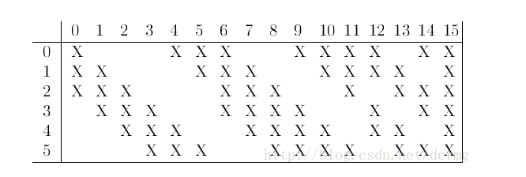
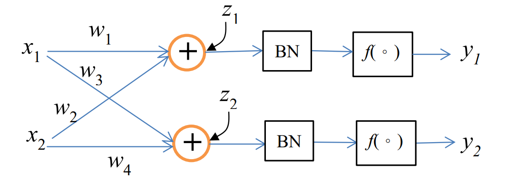

# Machine learning : HW 07 
## 王上澤 111598067
1. Find $\Delta w_1 = \eta \dfrac{\partial J}{\partial w_1} $  of the following CNN using backprop. The activation function from 𝑞1 to ℎ1 and 𝑞2 to ℎ2 is ReLU, the outputs 𝑦1 and 𝑦2 are softmax ouput, and the cost function is 𝐽 = − log 𝑦1. Let 𝑤1 to 𝑤6 be 1.0, 𝑥1 = 0.5, 𝑥2 = 1.0, 𝑥3 = -0.5, and 𝜂 = 0.1
    1. Find the $y_1$ $$y_1 = \dfrac{e^{z_1}}{e^{z_1}+e^{z_2}}$$ Find the $z_1$ and $z_2$ $$z_1 = w_3 q_1+ w_4 q_2 \\ z_2 = w_5 q_1+ w_6 q_2$$ then find the $q_1$ and $q_2$ $$q_1 = max(0, w_1x_1 + w_2x_2) \\ q_2 = max(0, w_1x_2 + w_2x_3)$$
    2. So the $y_1$ is 0.5, then the cost function is $$J = -\log{y_1}$$ and we assume the base of cost function to be $e$ so $$\dfrac{\partial J}{\partial y_1} = - \dfrac{1}{y_1} $$ than the first backprop is $$\dfrac{\partial J}{\partial y_1} = - \dfrac{1}{y_1} = -2 \\ \dfrac{\partial J}{\partial y_2} = - \dfrac{1}{y_2} = -2$$ 
    3. The derivative of the softmax activation function has the following form: $$\dfrac{\partial}{\partial z_i}y_l = \begin{cases} y_l(1-y_l), if \space i = l \\ -y_ly_i, if \space i \space \neq l\end{cases}$$ so next prop is $$\dfrac{\partial y_1}{\partial z_1} = y_1(1-y_1)=-6 \\ \dfrac{\partial y_2}{\partial z_2} = y_2(1-y_2) = -6$$
    4. Due to $-6(1) + -6(1) = -12<0$ so the derivative of $q_1$ is 0, so the $w_1$ won't update.

2. The following shows the LeNet-5 architecture. If we follow the modern design of the convolutional layers (taught in the lecture), compute the number of connections and trainable weights of the network. To compute the results, you need the following parameters for the convolutional layers: kernel size = 5×5, stride = 1, the first convolutional layer is padded, and the second convolutional layer is not padded. To simplify the computations, ignore the bias weights and let the output units be 10.
    1. First layer is a convolution layer 
        * input size = $28 \times 28$ 
        * kernel size = $5 \times 5$
        * feature number = 6
        * output size = $28 \times 28$ (due to the padding)
        * There are 6 feature map, so the total number of trainable weight  is $ 6 \times ( 5 \times 5 ) $ for one filter per feature map , and the total number of connection $ 6 \times ( 5 \times 5 ) \times 28 \times 28 $
    2. Second layer is sampling layer
        * sampling size = $2 \times 2 $ (we assume that)
        * input size = $ 6 \times 28 \times 28 $
        * output size = $ 6 \times 14 \times 14 $
        * numbers of trainable weight = 6 (for every feature map)
        * numbers of total connection = $6 \times (2 \times 2) \times 14 \times 14$
    3. Third layer is convolution layer
        * input size = $ 6 \times 14 \times 14 $
        * kernel size = $5 \times 5$
        * feature number = 16
        * output size = $ 16 \times (14 - 5 + 1) \times (14 - 5 + 1) $
        
        * numbers of trainable weight = $ 6 \times （3 \times 5 \times 5+1）+6 \times （4 \times 5 \times 5+1）+3 \times （4 \times 5 \times 5+1）+1 \times （6 \times 5 \times 5+1）$
        * numbers of total connection = $ 10 \times 10 \times [ 6 \times （3 \times 5 \times 5+1）+6 \times （4 \times 5 \times 5+1）+3 \times （4 \times 5 \times 5+1）+1 \times （6 \times 5 \times 5+1）]$
    4. Fourth layer is sampling layer
        * input size = $16 \times 10 \times 10 $
        * sampling size = $ 2 \times 2 $
        * sample number = 16
        * output size = $ 16 \times 5 \times 5 $
        * numbers of trainable weight = 16 (for every feature map)
        * numbers of total connection = $16 \times (2 \times 2) \times 5 \times 5$
    5. Fifth layer is convolution layer
        * input size = $ 16 \times 5 \times 5 $
        * kernel size = $5 \times 5$
        * feature number = 120
        * output size = $ 120 \times (5 - 5 + 1) \times (5 - 5 + 1) $
        * numbers of trainable weight = $ 120 \times (5 \times 5 \times 16)$
        * numbers of total connection = $ 120 \times (5 \times 5 \times 16)$
    6. Sixth layer is full connect layer
        * input size = 120
        * output size = 84
        * numbers of trainable weight = $ 120 \times 84$
        * numbers of total connection = $ 120 \times 84$
    7. Seventh layer is full connect layer
        * input size = 84
        * output size = 10
        * numbers of trainable weight = $ 84 \times 10$
        * numbers of total connection = $ 84 \times 10$
3. For the network shown below, derive the updating rule for 𝛽 and 𝛾 in the batch normalization (pp. 16). Let the desired outputs be $𝑑_1$ and $𝑑_2$, and the mini-batch contains N samples. You may use notations of $𝑥_1(𝑖)$, $𝑦_1(𝑖)$, etc. to indicate parameters associated with the i-th sample. To simplify the discussion, let the activation function be sigmoid and the cost function is MSE.

    1.  Forward propagation
        1. Input to the batch normalization layer (pre-normalization):$$z_{j}^{(i)} = \sum_k^{N} w_{jk}^{(i)}x_k^{(i)}$$
        2. Batch normalization transformation:$$\hat z_{j}^{(i)} = \gamma_j (\dfrac{z_j^{(i)} - \mu_j}{\sqrt{\sigma_j^2 + \epsilon}}) + \beta_j$$ where $\gamma_j$ is the scaling parameter (learnable), $\beta_j$ is the shifting parameter (learnable), $\mu_j$ is the mean of $z_j$ over the mini-batch, $\sigma_j$ is the standard deviation of $z_j$ over the mini-batch, $\epsilon$ is a small constant for numerical stability.
        3. Activation function (sigmoid in this case): $$h_j^{(i)} = \sigma(\hat z_j^{(i)}) = \dfrac{1}{1+e^{-\hat z_j^{(i)}}}$$
        4. Output of the batch normalization layer: $$y_j^{(i)} = w_j h_j^{(i)}$$
    2. Back propagation
        1. Derivative of the cost function with respect to the output of the batch normalization layer: $$\dfrac{\partial L}{\hat z_1} = \dfrac{\partial L}{\partial \hat y_1} \cdot \dfrac{\partial y_1}{\partial \hat z_1}$$
        2. Derivative of the cost function with respect to the scaling parameter, $\gamma$: $$\dfrac{\partial L}{\partial \gamma_1}=\sum_{i=1}^N \dfrac{\partial L}{\partial \hat z_1} \cdot \dfrac{\partial \hat z_1}{\partial \gamma_1}$$ since $\hat z_1 = \gamma_1 (\dfrac{z_1 - \mu_1}{\sqrt{\sigma_1^2 + \epsilon}}) + \beta_1$ ,the partial derivative is: $$\dfrac{\partial \hat z_1}{\partial \gamma_1} = \dfrac{z_1 - \mu_1}{\sqrt{\sigma_1^2 + \epsilon}}$$ Therefore, $$\dfrac{\partial L}{\partial \gamma_1} = \sum_{i=1}^N \dfrac{\partial L}{\partial \hat z_1} \cdot \dfrac{z_1 - \mu_1}{\sqrt{\sigma_1^2 + \epsilon}}$$ 
        3. Derivative of the cost function with respect to the shifting parameter, $\beta$ : $$\dfrac{\partial L}{\partial \beta_1}=\sum_{i=1}^N \dfrac{\partial L}{\partial \hat z_1} \cdot \dfrac{\partial \hat z_1}{\partial \beta_1}$$ Since $\hat z_1 = \gamma_1 (\dfrac{z_1 - \mu_1}{\sqrt{\sigma_1^2 + \epsilon}}) + \beta_1$ , the partial derivative is: $$\dfrac{\partial \hat z_1}{\partial \beta_1} = 1$$ Therefore, $$\dfrac{\partial L}{\partial \beta_1} = \sum_{i=1}^N \dfrac{\partial L}{\partial \hat z_1}$$
    3. Now, you can extend this derivation to other nodes in the network and calculate the derivatives with respect to $\beta $ and $\gamma$ for those nodes as well. Remember to use the chain rule and sum the contributions from all samples in the mini-batch when calculating the derivatives.

4. Build a 3-layer neural network by busing Keras to classify the Iris dataset. Vary the hidden units from 10 to 100 in the increment of 10 to observe the change of accuracy along with the number of hidden units. As usual, repeat the experiments 10 times to obtain the average accuracy. Use 10 epochs to train the network.
    * Code:
    ```python
    import numpy as np
    from sklearn.datasets import load_iris
    from sklearn.model_selection import train_test_split
    from sklearn.preprocessing import LabelBinarizer
    from tensorflow import keras

    # Load the Iris dataset
    iris = load_iris()
    X = iris.data
    y = iris.target

    # One-hot encode the target variable
    encoder = LabelBinarizer()
    y = encoder.fit_transform(y)

    # Set the number of hidden units to vary
    hidden_units = range(10, 110, 10)

    # Initialize a list to store the accuracies
    accuracies = []

    # Repeat the experiment 10 times
    for _ in range(10):
        # Split the data into training and testing sets
        X_train, X_test, y_train, y_test = train_test_split(X, y, test_size=0.2, random_state=42)

        # Iterate over different hidden units
        for units in hidden_units:
            # Build the neural network model
            model = keras.Sequential([
                keras.layers.Dense(units, input_shape=(4,), activation='relu'),
                keras.layers.Dense(units, activation='relu'),
                keras.layers.Dense(3, activation='softmax')
            ])

            # Compile the model
            model.compile(optimizer='adam', loss='categorical_crossentropy', metrics=['accuracy'])

            # Train the model
            model.fit(X_train, y_train, epochs=10, verbose=0)

            # Evaluate the model on the test set
            _, accuracy = model.evaluate(X_test, y_test, verbose=0)
            accuracies.append(accuracy)

    # Calculate the average accuracy
    average_accuracy = np.mean(accuracies)

    # Print the average accuracy
    print("Average accuracy:", average_accuracy*100, "%")
    ```
    * output:
    ```bash
    Average accuracy: 77.63333275541663 %
    ```

5. Build the modified LeNet-5, shown on Problem 2, by using Keras to classify the MNIST dataset. Use maxpolling in the pooling layer, the ReLU in the middle layers, and the softmax in the output layer. The MNIST dataset is available in keras via tf.keras.datasets.mnist.load_data(). Use 20 epochs to train the CNN and report the average accuracy after 10 trials.
    * code:
    ```python
    import numpy as np
    import tensorflow as tf
    from tensorflow import keras
    from tensorflow.keras import layers
    from sklearn.model_selection import train_test_split
    from tqdm import tqdm

    # Set random seed for reproducibility
    np.random.seed(42)
    tf.random.set_seed(42)

    # Load MNIST dataset
    (X_train, y_train), (X_test, y_test) = keras.datasets.mnist.load_data()

    # Reshape and normalize the input data
    X_train = X_train.reshape(-1, 28, 28, 1).astype("float32") / 255.0
    X_test = X_test.reshape(-1, 28, 28, 1).astype("float32") / 255.0

    # Split training data into training and validation sets
    X_train, X_val, y_train, y_val = train_test_split(X_train, y_train, test_size=0.1, random_state=42)

    # Define the modified LeNet-5 model
    model = keras.Sequential([
        layers.Conv2D(6, kernel_size=5, strides=1, activation="relu", input_shape=(28, 28, 1), padding="same"),
        layers.MaxPooling2D(pool_size=2, strides=2),
        layers.Conv2D(16, kernel_size=5, strides=1, activation="relu"),
        layers.MaxPooling2D(pool_size=2, strides=2),
        layers.Flatten(),
        layers.Dense(120, activation="relu"),
        layers.Dense(84, activation="relu"),
        layers.Dense(10, activation="softmax")
    ])

    # Compile the model
    model.compile(loss="sparse_categorical_crossentropy", optimizer="adam", metrics=["accuracy"])

    # Train the model for 20 epochs and report average accuracy after 10 trials
    num_trials = 10
    num_epochs = 20
    accuracy_scores = []

    for _ in tqdm(range(num_trials)):
        model.fit(X_train, y_train, epochs=num_epochs, validation_data=(X_val, y_val), verbose=0)
        _, accuracy = model.evaluate(X_test, y_test, verbose=0)
        accuracy_scores.append(accuracy)

    average_accuracy = sum(accuracy_scores) / num_trials    
    print("Average accuracy after 10 trials:", average_accuracy)
    ```
    * output:
    ```bash
    Downloading data from https://storage.googleapis.com/tensorflow/tf-keras-datasets/mnist.npz
    11490434/11490434 [==============================] - 0s 0us/step
    100%|██████████| 10/10 [22:37<00:00, 135.78s/it]
    Average accuracy after 10 trials: 0.9915199935436249
    ```

<script type="text/javascript" src="http://cdn.mathjax.org/mathjax/latest/MathJax.js?config=TeX-AMS-MML_HTMLorMML"></script>
<script type="text/x-mathjax-config">
    MathJax.Hub.Config({
         tex2jax: {inlineMath: [['$', '$'], ]}, messageStyle: "none" 
         });
</script>